# Building standalone IDIRA Secrets Manager Enterprise and K8s LAB
*(IDIRA Secrets Manager was formerly known as CyberArk Conjur - this README uses the current names throughout, except where quoting real filenames, URLs, CLI commands, or literal program output that still use the older "Conjur"/"CyberArk" names.)*

This project will help you to quickly build up the standalone, single VM lab environment to test Secrets Manager and k8s application integration including:
- Secrets Manager follower in kubernetes
- k8s jwt authentication
- Secrets Manager push to k8s file
- Secrets Manager push to kubernetes secret (sidecar and init container)
- native Secrets Manager Spring Boot SDK integration (no sidecar)
- External Secrets Operator (ESO) integration
- Secrets Manager CSI provider integration
- Kubernetes Authenticator Client + Summon integration
- and other

All setup, installing and configuration steps are all put in sequence of scripts to make the setup process quicker and easier

### Credits
This is an updated and polished fork of the original lab by Huy Do (huy.do@cyberark.com), based on the installing/configuration guide by Joe Tan (joe.tan@cyberark.com, https://github.com/joetanx). Kudos to both for the original work this builds on.

### Video on step by step setting up the original lab is at https://youtu.be/qiXBtv5R1z4
(some details - script names, base OS, a few added demos - have since changed in this fork, but the core flow still applies)

### Keeping this lab current
Run ```./check-versions.sh``` (needs ```curl``` and ```jq```) any time before rebuilding the lab to see which pinned image/chart/dependency versions are behind their current upstream release. It only reports drift - it never edits any file.

# PART I: SETING UP ENVIRONMENT
# 1.1. LAB Prerequisites
- ESXI server or VMWorkstation to create standalone lab VM as below:
  - 12GB RAM (minimum), recommended 16GB
  - 2 vCore CPU
  - 60GB HDD
  - Rocky Linux 9 base OS (Minimal Install)
    - Hostname: k8s.demo.local
    - LAN IP (eg 172.16.100.15/24)
    - Internet connection to do yum updating and packages installation
- Secrets Manager appliance image:
  - Contact IDIRA local representative for the appliance tarball (e.g. conjur-appliance-Rls-v13.9.0.tar.gz)
  - IDIRA softwares and related tools can be downloaded at https://cyberark-customers.force.com/mplace/s/#software
  - The Secrets Manager CLI is installed automatically by ```2.conjur-setup/06.installing-conjur-cli.sh``` (downloads [conjur-cli-go](https://github.com/cyberark/conjur-cli-go) from GitHub) - no manual download needed
- Java 17 (needed to build the Spring Boot cityapp in Part III.5 / ```4.cityapp-springboot```): saves time later to install it upfront with ```sudo dnf install -y java-17-openjdk java-17-openjdk-devel``` - not strictly required here, ```4.cityapp-springboot/01.building-cityapp-springboot-image.sh``` also installs it automatically if you skip this step

 *The IP addresses in this document are using from current lab environment. Please replace the **172.16.100.109** by your actual **VM IP**’s
    
# 1.2. VMs Preparation
## **Step1.2.1: Preparing Rocky Linux 9**
Rocky Linux 9 can be downloaded at https://rockylinux.org/download - grab the latest 9.x Minimal ISO.

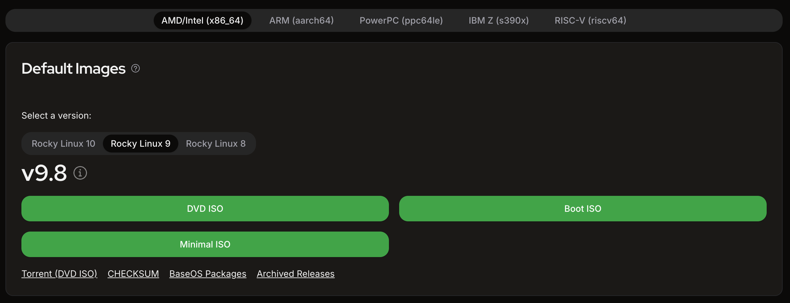

Create the VM and install with the minimal install option.

**Every command in this README assumes an actual root shell**, not `sudo <command>` run one at a time as a regular user. If you installed with a personal admin account (e.g. one created on the Anaconda user-creation screen) rather than enabling direct root login, get a root shell once and stay there for the rest of the lab:
```
sudo -i
```
Running individual commands as `sudo <cmd>` from a non-root user instead of this will eventually hit a permission error somewhere downstream - e.g. `git clone` in Step1.2.3 failing to write into `/opt/lab` because only the `sudo`-prefixed commands were actually root, not the shell itself. `sudo -i` avoids that entirely.

Once you're logged in to a freshly installed VM as root, a few one-liners before anything else:
```
#Set the hostname the rest of this lab expects
hostnamectl set-hostname k8s.demo.local

#Update the base OS
yum update -y

#Install the handful of tools the setup scripts assume are already present
#(openssl/tar/gzip ship with Minimal Install by default - listed for completeness)
yum -y install git curl jq openssl
```
Checking for IP, DNS and Internet connection
```
ip a
ping -c1 8.8.8.8
```

Checking sshd allows both password and SSH key login (useful if you'll be connecting from more than one workstation, or don't have a key handy yet) - Rocky/RHEL 9 split sshd config across drop-in files under `/etc/ssh/sshd_config.d/`, so check the *effective* config rather than grepping `sshd_config` alone:
```
sshd -T | grep -iE "^(passwordauthentication|pubkeyauthentication)"
```
If either comes back other than `yes`, enable both explicitly and restart sshd:
```
sed -i 's/^#*PasswordAuthentication.*/PasswordAuthentication yes/' /etc/ssh/sshd_config
sed -i 's/^#*PubkeyAuthentication.*/PubkeyAuthentication yes/' /etc/ssh/sshd_config
grep -q "^PasswordAuthentication" /etc/ssh/sshd_config || echo "PasswordAuthentication yes" >> /etc/ssh/sshd_config
grep -q "^PubkeyAuthentication" /etc/ssh/sshd_config || echo "PubkeyAuthentication yes" >> /etc/ssh/sshd_config
systemctl restart sshd
```
Note this widens auth options (password login is more brute-forceable than key-only) - fine for an isolated lab VM, but worth being deliberate about if this VM is reachable beyond your own network.
## **Step1.2.2: Copying files for setting up**
Create the setup_files folder:
```
mkdir -p /opt/lab/setup_files
chmod 755 /opt/lab/setup_files
```
Copy Secrets Manager appliance image file to setup_files folder
- Secrets Manager docker image: conjur-appliance-Rls-v13.9.0.tar.gz (or whatever version you received from IDIRA)
## **Step1.2.3: Cloning git hub repo**
This repo is public, so no GitHub auth is needed to clone it.
```
cd /opt/lab
git clone https://github.com/lprzyb/conjur-k8s-lab.git
```
Installation folder contains 8 sub folders for different setup
- 1.k8s-setup: scripts to setup k8s standalone cluster environment
- 2.conjur-setp: scripts to install podman, mysql, Secrets Manager leader containers and deploying Secrets Manager follower in k8s
- 3.cityapp-setup: scripts to deploy different types of cityapp application (hardcode, push-to-file, push-to-secret)
- 4.cityapp-springboot: builds the Spring Boot cityapp image and deploys it both ways - secrets-provider-for-k8s sidecar and native Secrets Manager SDK
- 5.conjur-eso: installs and configures the External Secrets Operator
- 6.conjur-csi: installs and configures the Secrets Manager CSI provider
- 7.conjur-summon: installs and configures the Kubernetes Authenticator Client + Summon
- 8.rotate-password: PART IV's password rotation script and the redeploy-helper for the apps that don't pick it up live

Each folder will have ```00.config.sh``` which contains some parameters. Review file content, change all related parameters to actual value and set ```READY=true``` before doing further steps.

# 1.3. (Optional) DNS / hosts file on your workstation
Browsing straight to ```http://<VM-IP>:PORT``` (as the rest of this README does) always works, no setup needed. But the Conjur Leader's TLS certificate is issued for ```conjur-leader.demo.local``` and ```conjur.demo.local``` (its ```-h```/```--leader-altnames``` in ```2.conjur-setup/05.configuring-conjur-leader.sh```), not for its IP - so visiting ```https://<VM-IP>/``` shows an extra "hostname mismatch" warning on top of the expected "self-signed, untrusted" one. Mapping the hostname on your own workstation clears that up. As a bonus, the landing page's links auto-adapt to whatever hostname you used to reach it (see ```1.k8s-setup/yaml/landing-page.html```) - visit it via ```k8s.demo.local``` and every link it generates will use that name too, instead of the raw IP.

Add to your workstation's hosts file (```/etc/hosts``` on macOS/Linux, ```C:\Windows\System32\drivers\etc\hosts``` on Windows, admin/root privileges required) or your lab's DNS server if you have one:
```
<VM-IP>  k8s.demo.local
<VM-IP>  conjur-leader.demo.local
<VM-IP>  conjur.demo.local
```
Replace ```<VM-IP>``` with your actual VM IP (```CONJUR_IP``` in ```2.conjur-setup/00.config.sh```). If you changed ```LAB_DOMAIN``` away from the ```demo.local``` default, use that value instead throughout.

This doesn't help the K8s Dashboard or the Secrets Manager Follower's own endpoint - both present generic self-signed certs not bound to any particular hostname, so you'll still see the "untrusted" warning there regardless of how you address them.

*macOS note: ```.local``` names are also handled by Bonjour/mDNS - a static hosts file entry still takes priority, but if you ever see stale/conflicting resolution, that's why.*

# PART II: SETING UP CONJUR - K8S LAB
# 2.1. Setting up K8s standalone cluster
## **Step2.1.0: Reviewing 00.config.sh**
```
cd /opt/lab/conjur-k8s-lab/1.k8s-setup
vi 00.config.sh
```
Set ```K8S_VERSION``` to the Kubernetes/CRI-O minor version to install (e.g. ```v1.35```) and set ```READY=true``` to continue. CRI-O and kubelet/kubeadm/kubectl must use the same minor version.

## **Step2.1.1: Installing cri-o**
```
./01.installing-cri-o.sh
```
Checking crio service after done to make sure crio is up and run
```
service crio status
```

## **Step2.1.2: Installing kubelet kubeadm and kubectl**
```
./02.installing-k8s-and-tools.sh
```

## **Step2.1.3: Setting up cluster and networking**
```
./03.creating-k8s-cluster.sh 
```
Make sure that cni0 interface is getting correct IP (in 10.244) before doing futher steps
```
ip address show dev cni0 | grep 10.244
```
Checking for the kubelet service status and cluster info
```
service kubelet status
kubectl get all
```

## **Step2.1.4: Setting up kubernetes dashboard**
```
./04.installing-k8s-dashboard.sh
```
Copy the value of service account token to notepad for later usage. Checking status of k8s dashboard deployment
```
kubectl -n kubernetes-dashboard get pods -o wide
```
Open browser and login to k8s dashboard using previous copied token
```
https://<VMIP>:30443
```


Select kube-system namespace and review some of the data in dashboard


## **Step2.1.5: Deploying the demo landing page**
```
./05.deploying-landing-page.sh
```
Deploys a single static page (plain HTML/CSS, no JS framework) with links to every demo you'll deploy in the following parts. Open it now and keep the tab open - links to demos you haven't deployed yet just won't connect until you get there.
```
http://<VM-IP>:30001
```

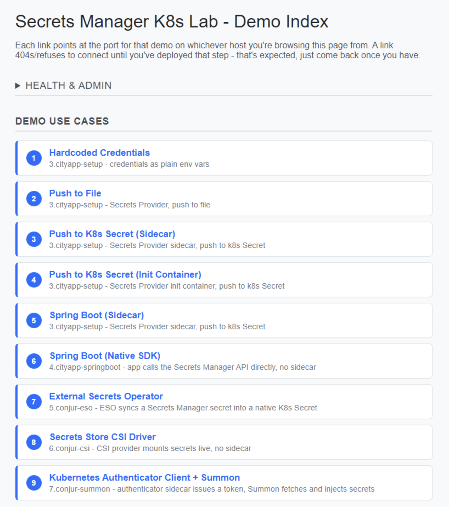

# 2.2. Setting up podman and Secrets Manager environment
## **Step2.2.1: Reviewing 00.config.sh**
```
cd /opt/lab/conjur-k8s-lab/2.conjur-setup
vi 00.config.sh
```
Changed all related parameters such as IP, domain, password... and set ```READY=true``` to continue

## **Step2.2.2: Installing podman**
```
./01.installing-podman.sh
```
Using ```podman image ls``` to check current podman images

## **Step2.2.3: Setting up mysql container and database**
```
./02.running-mysql-db.sh
```
Using command ```podman container ls``` to make sure mysql container is up and running.
Using command ```ping mysql.demo.local``` to make sure host entry has been added correctly

## **Step2.2.4: Installing Secrets Manager leader**
```
./03.loading-conjur-images.sh
./04.starting-conjur-container.sh
./05.configuring-conjur-leader.sh
```
Using command ```podman image ls | grep conjur``` to make sure that image is loaded correctly

Using command ```podman container ls``` to make sure that conjur1 container is up and running

Using command ```curl -k https://conjur-leader.demo.local/info``` to check conjur leader status

Using browser and put in Secrets Manager leader URL ```https://<VMIP>```, login using user admin and password was set in ```00.config.sh``` file
```
https://<VM-IP>/
```

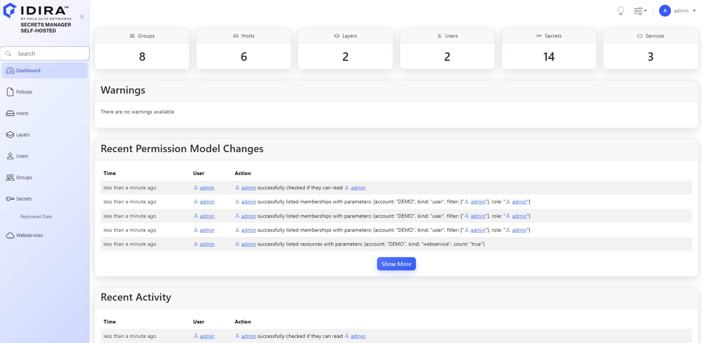

## **Step2.2.5: Installing Secrets Manager CLI**
```
./06.installing-conjur-cli.sh
```

The script installs the [conjur-cli-go](https://github.com/cyberark/conjur-cli-go) binary, runs ```conjur init self-hosted``` (self-signed cert trusted automatically via ```-s```), then ```conjur login``` - enter the admin password when prompted.

Using command ```conjur whoami``` to doublecheck the result.

## **Step2.2.6: Loading demo data and enable conjur-k8s-jwt authentication**
```
./07.loading-demo-data.sh
./08.enable-k8s-jwt-authenticator.sh
```
Using ```curl -k https://conjur-leader.demo.local/info``` to see the authenticaion options that are enabled.
```
...
  "authenticators": {
    "installed": [
      "authn",
      "authn-azure",
      "authn-gcp",
      "authn-iam",
      "authn-jwt",
      "authn-k8s",
      "authn-ldap",
      "authn-oidc"
    ],
    "configured": [
      "authn",
      "authn-jwt/k8s"
    ],
    "enabled": [
      "authn",
      "authn-jwt/k8s"
...    
```
Running below command to load jwt data to Secrets Manager environment
```
./09.loading-conjur-jwt-data.sh 
```
Using browser, login to Secrets Manager GUI to review the demo data and content. Make sure all authn-jwt/k8s secrets got values
- conjur/authn-jwt/k8s/audience: jwt audience, should be ```cybrdemo``` by default.
- conjur/authn-jwt/k8s/identity-path: jwt path for identity, should be ```jwt-apps/k8s``` by default.
- conjur/authn-jwt/k8s/issuer: jwt issuer, should be ```https://kubernetes.default.svc.cluster.local``` by default
- conjur/authn-jwt/k8s/public-keys: k8s public key information, should be in json format.

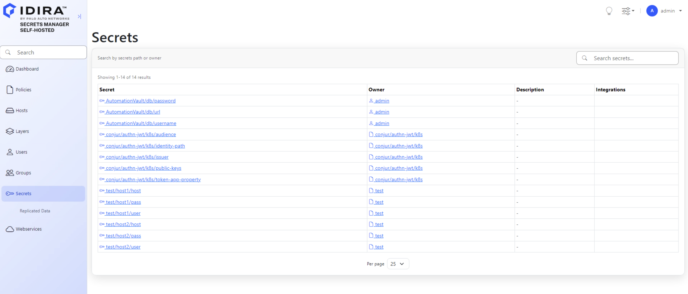

If any of above parameters is emply, please run script ```./09.loading-conjur-jwt-data.sh``` again.

## **Step2.2.7: Deploying Secrets Manager follower on k8s**
```
./10.loading-k8s-follower-configmap.sh 
./11.deploying-follower-k8s.sh 
```
Login to k8s dashboard, select namespace conjur and checking for follower deployment and pod status

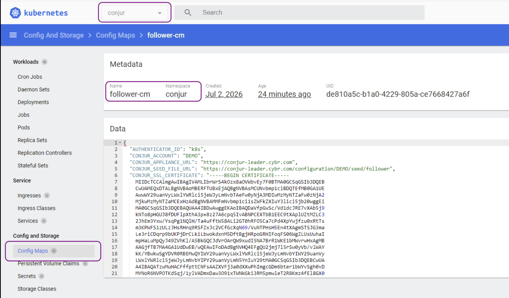

Login to Secrets Manager GUI, go to ```seting>Secrets Manager Cluster``` to check for follower status
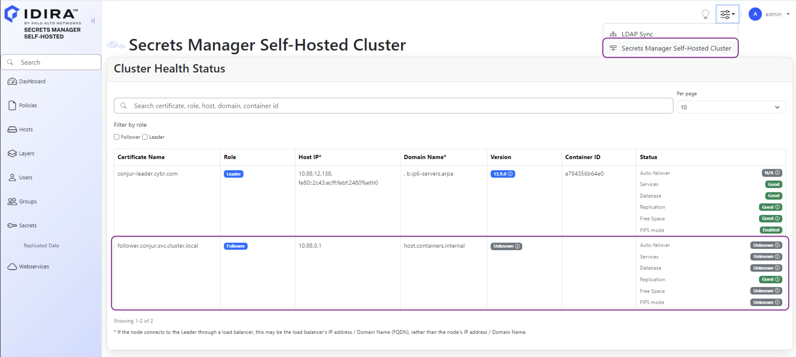

Using command ```curl -k https://<VM-IP>:30444/info``` to check for follower detai info
```
...
  "authenticators": {
    "installed": [
      "authn",
      "authn-azure",
      "authn-gcp",
      "authn-iam",
      "authn-jwt",
      "authn-k8s",
      "authn-ldap",
      "authn-oidc"
    ],
    "configured": [
      "authn",
      "authn-jwt/k8s"
    ],
    "enabled": [
      "authn-jwt/k8s"
    ]
...
```

### A note on the Secrets Manager Cluster page's "Unknown" Follower status
The Follower's Services/Database/Free Space columns on the Secrets Manager Cluster
page (Step2.2.7 above) show "Unknown" out of the box, and its Domain Name
column shows ```host.containers.internal``` instead of anything meaningful -
this is expected for this lab's topology, not a bug, and the original repo's
own reference screenshot shows the identical result.

This lab configures a plain Leader + Follower replication setup
(```05.configuring-conjur-leader.sh``` runs ```evoke configure leader``` with
no ```--auto-failover```/etcd cluster flags), not Secrets Manager Enterprise's separate
Auto-Failover clustering feature - which is why the Leader's own row shows
```Auto-failover: N/A``` too. The Follower's Services/Database/Free Space
status specifically depends on Auto-Failover's etcd-based health-monitoring
agent, which isn't configured here; its Replication status still shows real
data because that comes from Postgres's own replication view, not the
missing agent. The Domain Name/Host IP columns come from a reverse DNS
lookup on the connection's source address rather than the node's own
hostname - for the Follower that source is podman's own NAT gateway address
(this lab runs the Leader and Follower on the same VM, so the Follower
reaches the Leader via the VM's external IP, which loops back through
podman's port-publishing NAT), the same class of artifact the page's own
disclaimer describes for a load balancer.

# PART III: TESTING CITYAPP OPTIONS
Every demo scenario from here through Part IV is one of the links on the landing page deployed in Part II - shown below for convenience, so you can jump between demos without scrolling back and forth. That's optional though: every step below also gives its own standalone URL, which works whether or not you ever open the landing page.

New to DevOps or Kubernetes? [explain-use-cases.md](./explain-use-cases.md) walks through all 9 methods below in plain English - analogies, diagrams, and the actual code responsible for each one - before you dive into running them yourself.

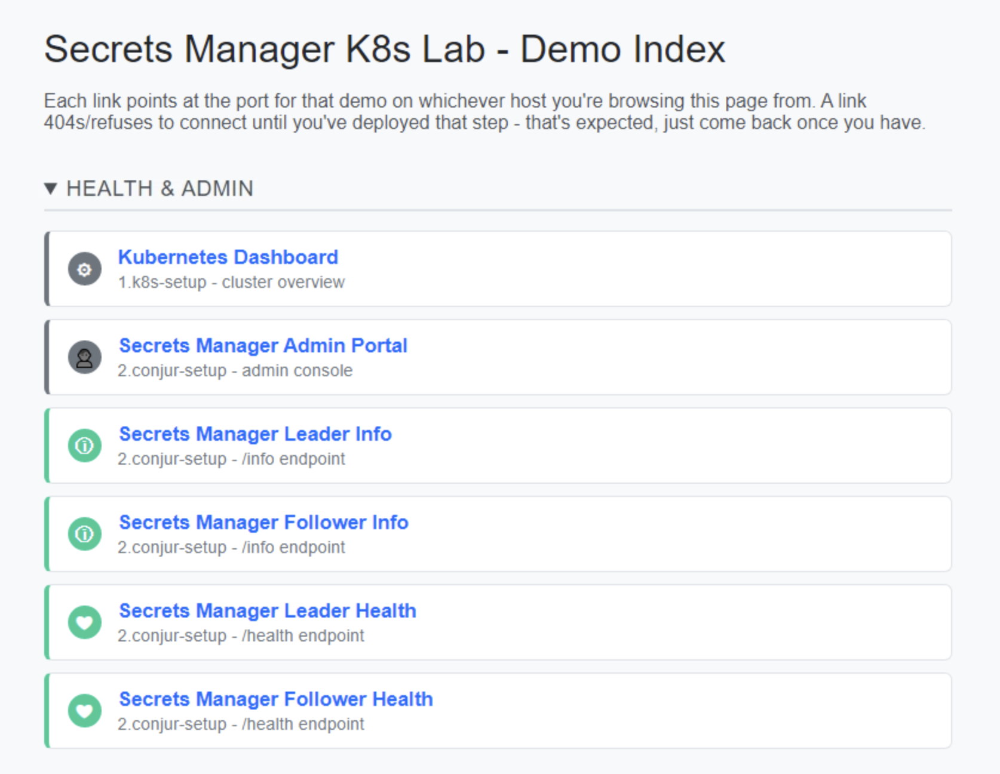

# 3.1. Building cityapp image
## **Step3.1.1: Reviewing 00.config.sh**
```
cd /opt/lab/conjur-k8s-lab/3.cityapp-setup
vi 00.config.sh
```
Changed all related parameters such as IP, domain... and set ```READY=true``` to continue
## **Step3.1.2: Building image**
Review the cityapp image detail on /opt/lab/conjur-k8s-lab/3.cityapp-setup/build
- Dockerfile: contain building info
- index.php: detail code of cityapp web application

Running below command to build cityapp image
```
./01.building-cityapp-image.sh
```
Using command ```podman image ls | grep cityapp``` to make sure cityapp image has been build and put at localhost/cityapp

# 3.2. Running cityapp-hardcode
```
./02.running-cityapp-hardcode.sh
```
Using browser and access to ```http://<VM-IP>:30080``` to open cityapp-hardcode webapp for the result

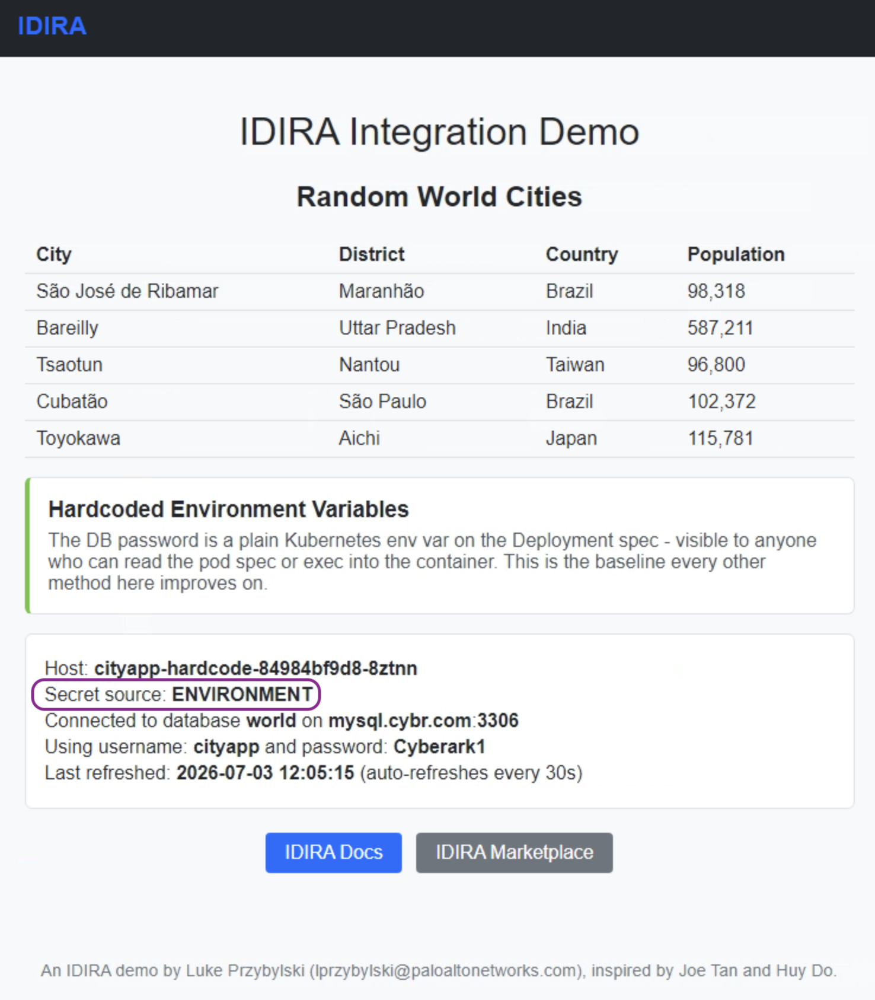

Using k8s dashboard GUI and select cityapp namespace to see more detail on cityapp-hardcode pod. This application is being run with database credentials from environment parameters.

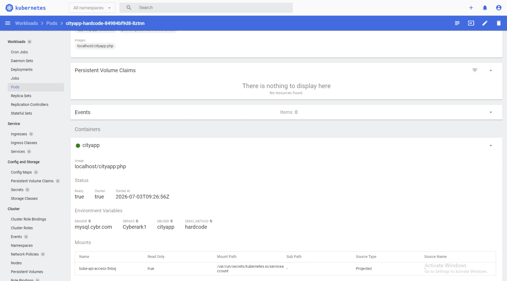

# 3.3. Running cityapp-conjurtok8sfile
Application cityapp-conjurtok8sfile is configured with sidecar container (secrets-provider-for-k8s) which is run in the same pod with cityapp. The sidecar will connect to conjur follower pod, using jwt authentication method and check for database credentials. Information will then be written into ```/conjur/secret``` folder and linked to cityapp's ```/conjur``` folder using shared volume. The architecture of this method is described at below IDIRA document link.

[IDIRA Secret Provider: Push to File mode](https://docs.cyberark.com/Product-Doc/OnlineHelp/AAM-DAP/Latest/en/Content/Integrations/k8s-ocp/cjr-k8s-secrets-provider-ic-p2f.htm?TocPath=Integrations%7COpenShift%2FKubernetes%7CSet%20up%20applications%7CSecrets%20Provider%20for%20Kubernetes%7CInit%20container%7C_____2 "Push to file")


To deploy conjurtok8sfile application, run:
```
./03.running-cityapp-conjurtok8sfile.sh
```

Going to k8s dashboard GUI, select cityapp namespace and open cityapp-conjurtok8sfile 's sidecar container log, the detail of authentication result will be shown as below
```
INFO:  2026/07/03 14:48:22.910355 entrypoint.go:346: CSPFK014I Authenticator setting LOG_LEVEL provided by environment
INFO:  2026/07/03 14:48:22.910426 entrypoint.go:346: CSPFK014I Authenticator setting DEBUG provided by environment
INFO:  2026/07/03 14:48:22.910432 entrypoint.go:89: CSPFK008I CyberArk Secrets Provider for Kubernetes v1.10.0-bcf147d starting up
INFO:  2026/07/03 14:48:22.910539 entrypoint.go:346: CSPFK014I Authenticator setting LOG_LEVEL provided by environment
INFO:  2026/07/03 14:48:22.910546 entrypoint.go:346: CSPFK014I Authenticator setting DEBUG provided by environment
INFO:  2026/07/03 14:48:22.910553 configuration_factory.go:89: CAKC070 Chosen "authn-jwt" configuration
INFO:  2026/07/03 14:48:22.910569 entrypoint.go:337: CSPFK014I Authenticator setting CONTAINER_MODE provided by annotation conjur.org/container-mode
INFO:  2026/07/03 14:48:22.910574 entrypoint.go:346: CSPFK014I Authenticator setting DEBUG provided by environment
INFO:  2026/07/03 14:48:22.910580 entrypoint.go:346: CSPFK014I Authenticator setting LOG_LEVEL provided by environment
INFO:  2026/07/03 14:48:22.910586 entrypoint.go:337: CSPFK014I Authenticator setting JWT_TOKEN_PATH provided by annotation conjur.org/jwt-token-path
INFO:  2026/07/03 14:48:22.910590 entrypoint.go:346: CSPFK014I Authenticator setting CONJUR_AUTHN_LOGIN provided by environment
INFO:  2026/07/03 14:48:22.911174 authenticator_factory.go:34: CAKC075 Chosen "authn-jwt" flow
INFO:  2026/07/03 14:48:22.911328 authenticator.go:98: CAKC066 Performing authn-jwt
INFO:  2026/07/03 14:48:22.950823 authenticator.go:118: CAKC035 Successfully authenticated
INFO:  2026/07/03 14:48:22.950855 conjur_client.go:23: CSPFK002I Creating DAP/Conjur client
WARN:  2026/07/03 14:48:22.951080 conjur_client_wrapper.go:28: CSPFK090E V2 batch retrieval not available, falling back to V1: V2 Batch Retrieve Secrets API is not supported in Conjur Enterprise/OSS
INFO:  2026/07/03 14:48:22.970436 provide_conjur_secrets.go:126: CSPFK015I DAP/Conjur Secrets pushed to shared volume successfully
```

Using browser and go to ```http://<VM-IP>:30081``` to see the result
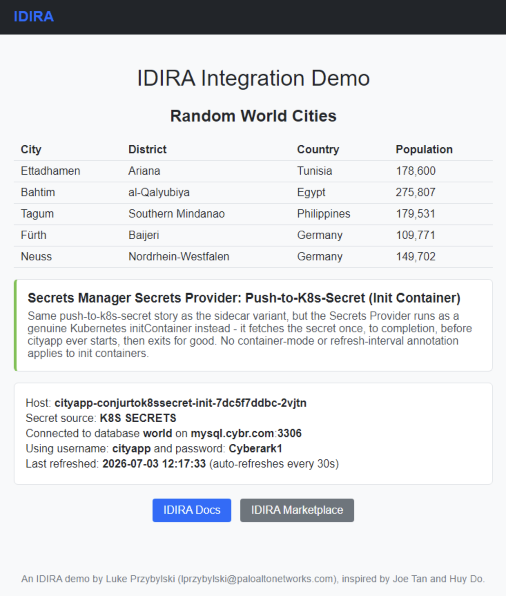

# 3.4. Running cityapp-conjurtok8ssecret
Application cityapp-conjurtok8ssecret is configured with a secrets-provider-for-k8s container in the same pod as cityapp (a sidecar - `conjur.org/container-mode: sidecar` plus `CONTAINER_MODE: init` on the provider container is the officially documented combination for this mode, see IDIRA's own Sidecar-tab example at the link below - `CONTAINER_MODE: init` here does not mean "runs once and exits"). It connects to the conjur follower pod using the jwt authentication method, fetches the database credentials, and keeps pushing them into kubernetes secret name ```db-creds``` (configured in the application's namespace, needs RBAC configuration to allow the update method on k8s secrets) on the interval set by ```conjur.org/secrets-refresh-interval```. When cityapp's main container running, it will access to secret content via files in /etc/secret-volume which is the shared volume that is linked to secret ```db-creds``` - since that's a K8s Secret **volume mount**, its content stays in sync automatically as the sidecar keeps updating ```db-creds```. The architecture of this method is described at below IDIRA document link.

[IDIRA Secret Provider: Kubernetes Secret mode](https://docs.cyberark.com/Product-Doc/OnlineHelp/AAM-DAP/Latest/en/Content/Integrations/k8s-ocp/cjr-k8s-secrets-provider-ic.htm?tocpath=Integrations%7COpenShift%252FKubernetes%7CApp%20owner%253A%20Set%20up%20workloads%20in%20Kubernetes%7CSet%20up%20workloads%20(cert-based%20authn)%7CSecrets%20Provider%20for%20Kubernetes%7CInit%20container%252FSidecar%7C_____1 "Push to secret")


```
./04.running-cityapp-conjurtok8ssecret.sh
```

In k8s dashboard's GUI, checking for the conjurtok8ssecret container's log in the pod, the detail of conjur jwt authentication and secret pushing will be shown as below
```
INFO:  2026/07/03 14:49:34.323752 entrypoint.go:346: CSPFK014I Authenticator setting LOG_LEVEL provided by environment
INFO:  2026/07/03 14:49:34.323826 entrypoint.go:346: CSPFK014I Authenticator setting DEBUG provided by environment
INFO:  2026/07/03 14:49:34.323833 entrypoint.go:89: CSPFK008I CyberArk Secrets Provider for Kubernetes v1.10.0-bcf147d starting up
INFO:  2026/07/03 14:49:34.323935 entrypoint.go:346: CSPFK014I Authenticator setting LOG_LEVEL provided by environment
INFO:  2026/07/03 14:49:34.323942 entrypoint.go:346: CSPFK014I Authenticator setting DEBUG provided by environment
INFO:  2026/07/03 14:49:34.323948 configuration_factory.go:89: CAKC070 Chosen "authn-jwt" configuration
INFO:  2026/07/03 14:49:34.323964 entrypoint.go:337: CSPFK014I Authenticator setting CONTAINER_MODE provided by annotation conjur.org/container-mode
INFO:  2026/07/03 14:49:34.323970 entrypoint.go:346: CSPFK014I Authenticator setting DEBUG provided by environment
INFO:  2026/07/03 14:49:34.323976 entrypoint.go:346: CSPFK014I Authenticator setting LOG_LEVEL provided by environment
INFO:  2026/07/03 14:49:34.323982 entrypoint.go:346: CSPFK014I Authenticator setting JWT_TOKEN_PATH provided by environment
INFO:  2026/07/03 14:49:34.323987 entrypoint.go:346: CSPFK014I Authenticator setting CONJUR_AUTHN_LOGIN provided by environment
INFO:  2026/07/03 14:49:34.324023 entrypoint.go:366: CSPFK012I Secrets Provider setting 'ContainerMode' set by both environment variable 'CONTAINER_MODE' and annotation 'conjur.org/container-mode'
INFO:  2026/07/03 14:49:34.324582 k8s_secrets_client.go:117: CSPFK004I Creating Kubernetes client
INFO:  2026/07/03 14:49:34.325252 k8s_secrets_client.go:25: CSPFK005I Retrieving Kubernetes secret 'db-creds' from namespace 'cityapp'
INFO:  2026/07/03 14:49:34.332495 authenticator_factory.go:34: CAKC075 Chosen "authn-jwt" flow
INFO:  2026/07/03 14:49:34.332692 authenticator.go:98: CAKC066 Performing authn-jwt
INFO:  2026/07/03 14:49:34.368538 authenticator.go:118: CAKC035 Successfully authenticated
INFO:  2026/07/03 14:49:34.368572 conjur_client.go:23: CSPFK002I Creating DAP/Conjur client
WARN:  2026/07/03 14:49:34.368754 conjur_client_wrapper.go:28: CSPFK090E V2 batch retrieval not available, falling back to V1: V2 Batch Retrieve Secrets API is not supported in Conjur Enterprise/OSS
INFO:  2026/07/03 14:49:34.388283 k8s_secrets_client.go:117: CSPFK004I Creating Kubernetes client
INFO:  2026/07/03 14:49:34.388753 k8s_secrets_client.go:48: CSPFK006I Updating Kubernetes secret 'db-creds' in namespace 'cityapp'
INFO:  2026/07/03 14:49:34.392062 provide_conjur_secrets.go:253: CSPFK009I DAP/Conjur Secrets updated in Kubernetes successfully
```

Using browser and go to ```http://<VM-IP>:30082``` to see the result
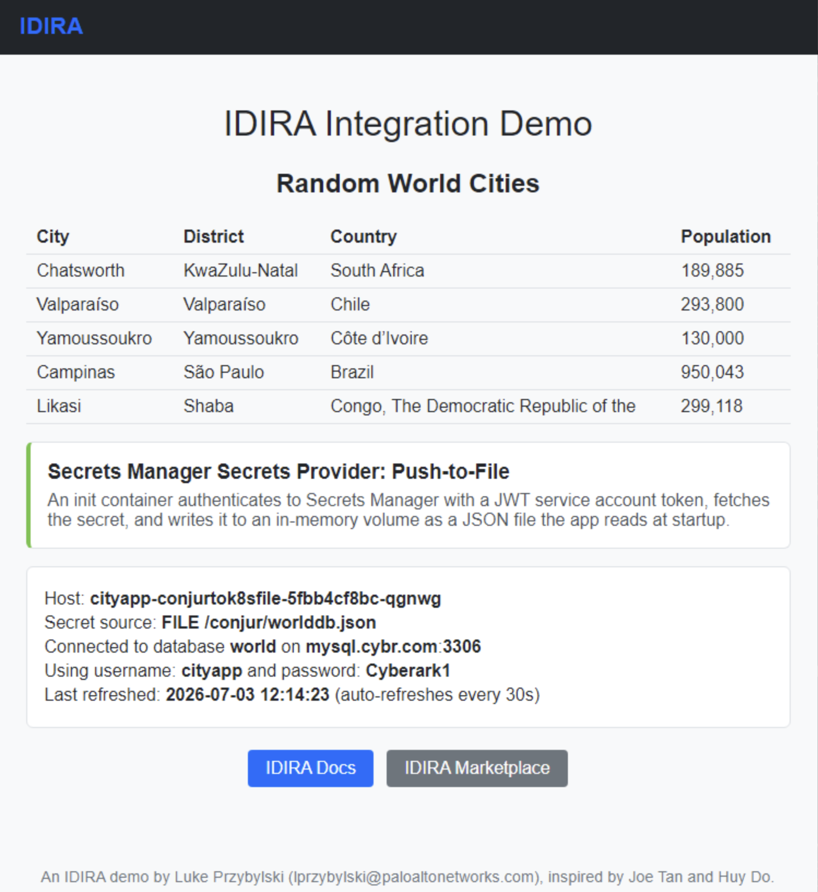

## Push-to-K8s-Secret, init container variant
The Secrets Provider is officially documented in two placements - the Sidecar mode above, and an **Init container** mode. ```yaml/cityapp-conjurtok8ssecret-init.yaml``` demonstrates the latter: the exact same push-to-k8s-secret story, but the Secrets Provider runs as a genuine Kubernetes ```initContainers:``` entry instead of a sidecar - it fetches the secret once, to completion, *before* cityapp ever starts, then exits for good rather than staying alive for the pod's lifetime. Neither ```conjur.org/container-mode``` nor ```conjur.org/secrets-refresh-interval``` applies here, since init containers have no ongoing process to put in sidecar mode or refresh on an interval. It reuses the same ServiceAccount, Conjur host identity, RBAC and ```db-creds``` Secret as the sidecar variant above - no new Conjur policy is needed.
```
./05.running-cityapp-conjurtok8ssecret-init.sh
```
Using browser and go to ```http://<VM-IP>:30085``` to see the result.

# 3.5. Building and running cityapp-springboot
This is a Java/Spring Boot rewrite of cityapp, built from ```4.cityapp-springboot/build/``` (a Maven project). Its business logic and web page are the same as the PHP cityapp, but it can be deployed two different ways that are worth trying separately. Both the build and both deployment options now live together in ```4.cityapp-springboot/```, for the same reason folder 4 exists at all - everything springboot-specific in one place.

## Step3.5.1: Building the image
```
cd /opt/lab/conjur-k8s-lab/4.cityapp-springboot
vi 00.config.sh
```
Set ```READY=true```, then build the image:
```
./01.building-cityapp-springboot-image.sh
```
This installs Java 17, runs the Maven build, and tags the result ```cityapp-springboot```. If the build tools aren't available it automatically falls back to pulling a prebuilt image instead, so this step always produces something usable either way.

## Step3.5.2: Deploying cityapp-springboot - two options
Both options deploy the same image built above, but as separate Deployments/Services with their own NodePort, so you can run both side by side and compare them directly.

**Option A - secrets-provider-for-k8s sidecar** (same mechanism as Step 3.3/3.4 above, just with the Java app instead of PHP):
```
./02.running-cityapp-springboot-sidecar.sh
```
Using browser and go to ```http://<VM-IP>:30083``` to see the result.

**Option B - native Secrets Manager Spring Boot SDK** (the app itself calls the Secrets Manager API directly at startup via `ConjurSpringDbConfig.java` - no sidecar, no secrets-provider-for-k8s):
```
./03.running-cityapp-springboot-native.sh
```
Using browser and go to ```http://<VM-IP>:30088``` to see the result.

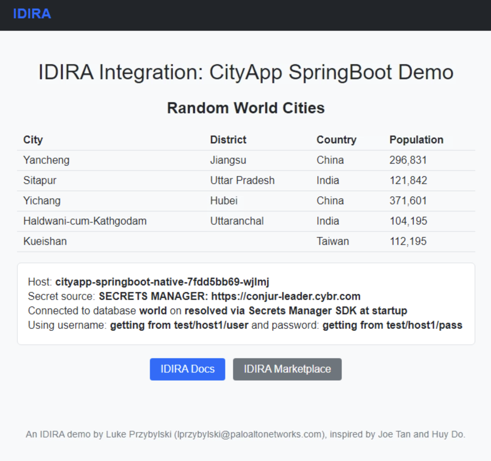

# PART III-A: TESTING EXTERNAL SECRETS OPERATOR (ESO)
Unlike the sidecar-based variants above, this section shows secrets flowing into Kubernetes from *outside* the pod entirely: the [External Secrets Operator](https://external-secrets.io/latest/) (ESO) authenticates to Secrets Manager on its own and syncs a value into a native Kubernetes Secret, and the app that consumes it needs no Secrets Manager awareness at all - no sidecar, no ServiceAccount, no JWT token.

## Step3A.1: Reviewing 00.config.sh
```
cd /opt/lab/conjur-k8s-lab/5.conjur-eso
vi 00.config.sh
```
Set ```READY=true``` to continue - this folder reuses the same ```2.conjur-setup/00.config.sh``` values (domain, DB credentials, JWT audience).

## Step3A.2: Installing ESO
```
./01.installing-eso-helm.sh
```
Installs Helm if missing, then the ```external-secrets``` Helm chart into its own namespace.

## Step3A.3: Loading the ESO Secrets Manager policy
```
./02.adding-conjur-eso-policy.sh
```
Grants the ESO service account JWT authentication access, and sets a second demo variable set (```test/CityAppESO/DBAccountESO/address```, ```test/CityAppESO/DBAccountESO/username```, ```test/CityAppESO/DBAccountESO/password```) to the same working database credentials used elsewhere in the lab.

## Step3A.4: Creating the Secrets Manager SecretStore
```
./03.creating-ext-secret-store.sh
```
Registers Secrets Manager as an ESO ```SecretStore``` using JWT auth against the Secrets Manager follower.

## Step3A.5: Creating the ExternalSecret
```
./04.creating-eso-secret.sh
```
Tells ESO to sync ```test/CityAppESO/DBAccountESO/*``` into a native Kubernetes Secret named ```conjur-secret```.

## Step3A.6: Verifying the synced secret
```
./05.getting-eso-secret.sh
```
Prints the ```ExternalSecret``` sync status and the decoded contents of ```conjur-secret```.

## Step3A.7: Running cityapp-eso
```
./06.running-cityapp-eso.sh
```
Deploys the same ```cityapp``` PHP image built in Part III, unmodified, mounting ```conjur-secret``` directly at ```/etc/secret-volume```. Using browser and go to ```http://<VM-IP>:30084``` to see the result - the page will show the secret source as "K8S SECRETS", same as ```cityapp-conjurtok8ssecret```, but this Secret was populated by ESO rather than a sidecar.

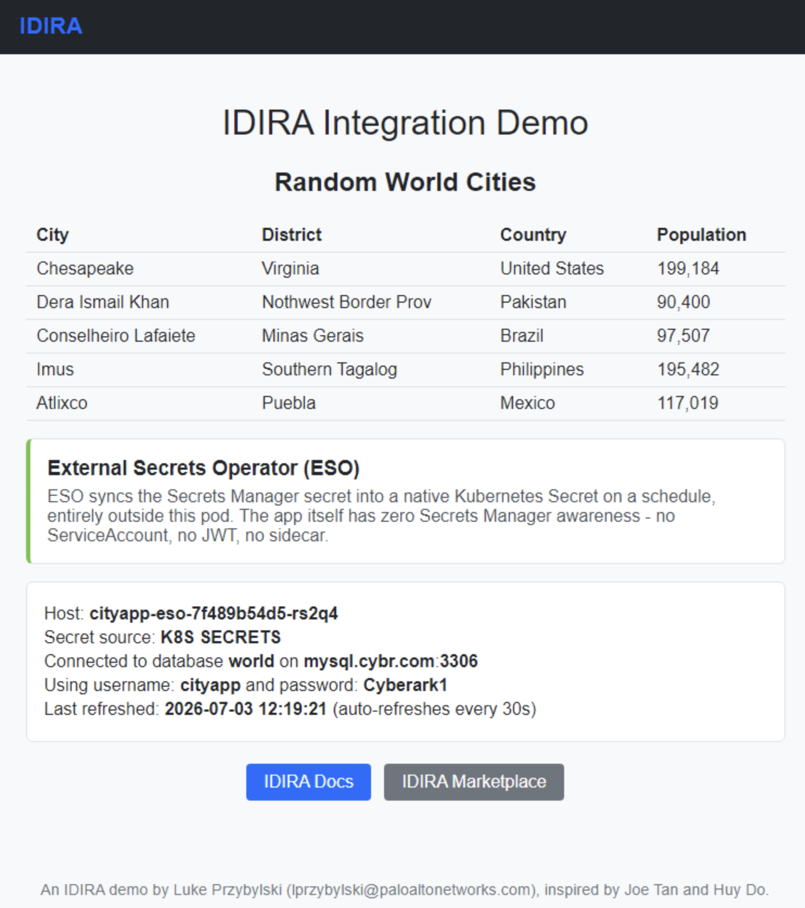

# PART III-B: TESTING THE CONJUR CSI PROVIDER
A third way to deliver secrets into a pod: the [Kubernetes Secrets Store CSI Driver](https://kubernetes-csi.github.io/docs/) mounts them directly as a volume, resolved live by IDIRA's Secrets Manager CSI provider at mount time. The provider authenticates using an explicit identity rather than auto-resolving one from JWT claims, so - like ESO - the app itself needs no ServiceAccount token projection, sidecar, or Secrets Manager awareness.

## Step3B.1: Reviewing 00.config.sh
```
cd /opt/lab/conjur-k8s-lab/6.conjur-csi
vi 00.config.sh
```
Set ```READY=true``` to continue. This folder reuses ```2.conjur-setup/00.config.sh``` and additionally defines ```CSI_JWT_AUDIENCE``` (default ```conjur```) - the audience the CSI driver requests tokens with, distinct from the lab's shared ```JWT_AUDIENCE```.

## Step3B.2: Installing the Secrets Store CSI Driver
```
./01.installing-csi-helm.sh
```
Installs Helm if missing, then the ```secrets-store-csi-driver``` chart into ```kube-system```.

## Step3B.3: Loading the CSI Secrets Manager policy
```
./02.adding-conjur-csi-jwt-policy.sh
```
Defines a second, CSI-specific JWT authenticator (```authn-jwt/k8s-csi```, distinct from the ```authn-jwt/k8s``` used everywhere else) and its host identity.

## Step3B.4: Redeploying the Secrets Manager follower with CSI support
```
./03.redeploy-follower-with-k8s-csi.sh
```
Replaces the follower deployed in Part II with one that has both ```authn-jwt/k8s``` and ```authn-jwt/k8s-csi``` enabled.

## Step3B.5: Installing the Secrets Manager CSI provider
```
./04.installing-conjur-csi-provider.sh
```
Installs IDIRA's ```conjur-k8s-csi-provider``` Helm chart into ```kube-system```.

## Step3B.6: Creating the SecretProviderClass
```
./05.creating-secret-provider-class.sh
```
Creates a ```SecretProviderClass``` named ```conjur-credentials``` in the ```cityapp``` namespace, pointing at the Conjur follower.

## Step3B.7: Running cityapp-csi
```
./06.running-cityapp-csi-test.sh
```
Deploys ```cityapp-csi```, mounting secrets via the CSI volume at ```/etc/secret-volume``` (resolved from ```test/CityApp/DBAccount/*```, the same working demo credentials used since Part II). Using browser and go to ```http://<VM-IP>:30086``` to see the result.

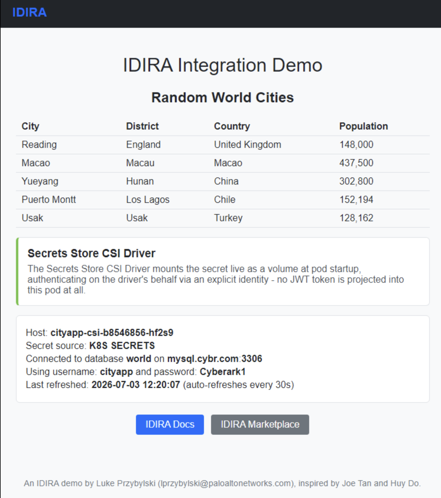

# PART III-C: TESTING THE KUBERNETES AUTHENTICATOR CLIENT + SUMMON
A fourth, architecturally distinct way to deliver secrets: a ```cyberark/conjur-authn-k8s-client``` sidecar authenticates the pod via JWT and writes *only* an access token to a shared volume - unlike every method above, it never fetches or pushes the secret itself. [Summon](https://github.com/cyberark/summon), baked into this variant's own image, uses that token to call the Secrets Manager REST API directly and inject the fetched values as real process environment variables before ```cityapp``` even starts - landing in the exact same ```getenv('DBADDR')``` code path ```cityapp-hardcode``` already used, so no application code changes were needed, only a different image build.

## Step3C.1: Reviewing 00.config.sh
```
cd /opt/lab/conjur-k8s-lab/7.conjur-summon
vi 00.config.sh
```
Set ```READY=true``` to continue - this folder reuses the same ```2.conjur-setup/00.config.sh``` values.

## Step3C.2: Loading the Summon Secrets Manager policy
```
./01.adding-conjur-summon-policy.sh
```
Adds a ```cityapp-summon``` host to the existing ```authn-jwt/k8s``` authenticator and grants it read/execute on ```test/CityApp/DBAccount/*``` - the same working demo credentials used since Part II. Like ESO's policy in Part III-A, this is a self-contained addition and does not modify ```2.conjur-setup/policies/authn-jwt-k8s.yaml```.

## Step3C.3: Building the cityapp-summon image
```
./02.building-cityapp-summon-image.sh
```
Builds ```localhost/cityapp:summon``` on top of ```localhost/cityapp:php``` (Part III's image must be built first) - adds the Summon binary and the ```summon-conjur``` provider, and overrides the entrypoint to ```summon -f /etc/summon/secrets.yml apache2-foreground```.

## Step3C.4: Running cityapp-summon
```
./03.running-cityapp-summon.sh
```
Deploys ```cityapp-summon``` with the authenticator sidecar. Using browser and go to ```http://<VM-IP>:30087``` to see the result - the page will show the secret source as "ENVIRONMENT", same as ```cityapp-hardcode```, but here the values were fetched live from Secrets Manager rather than baked into the Deployment spec.

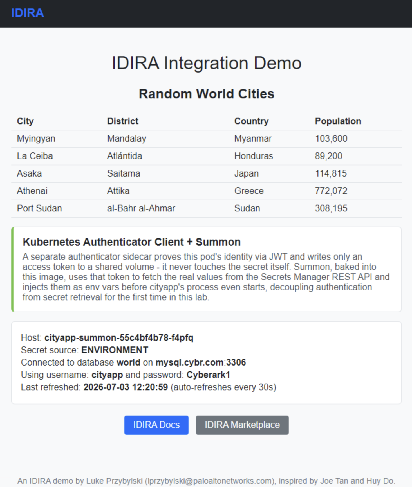

This is the same JWT authentication flow used by every variant since Part II (a projected ServiceAccount token, exchanged for a Secrets Manager access token) - the diagram below traces the full path, from the authenticator sidecar's token all the way to Summon injecting the fetched secret into cityapp's environment.

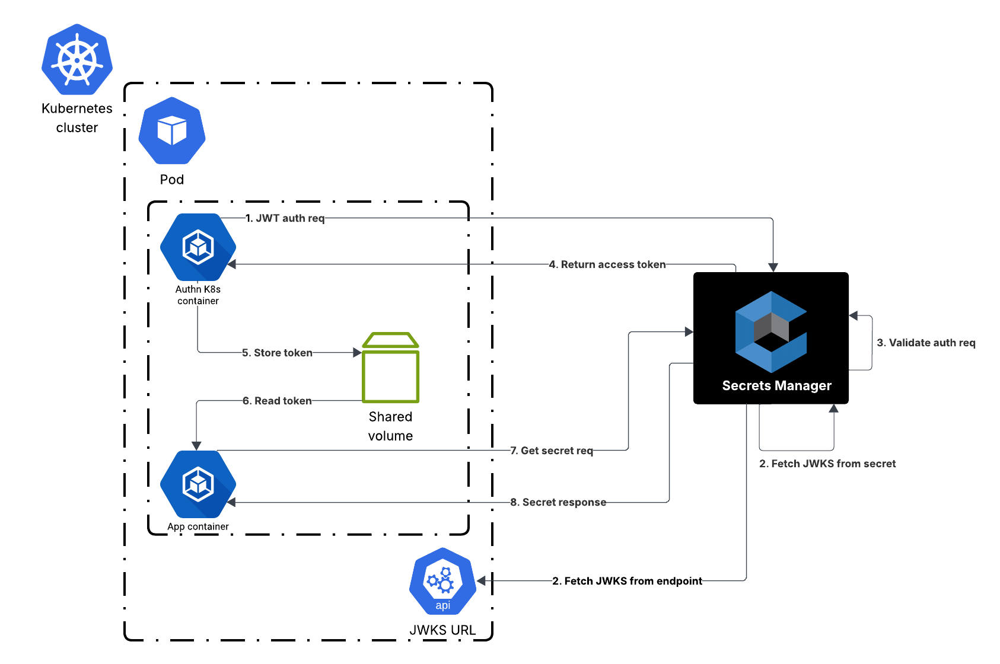

# PART IV: FINAL TESTING
This is the actual payoff of the whole lab: rotate the real database password once, and watch each of the 9 integration methods handle it differently - some update live, some need a redeploy, and two are deliberately left broken. It's done in up to five steps, but most people only need the first one.

## Step4.1: Rotate the real password (test/CityApp/DBAccount/*)
```
cd /opt/lab/conjur-k8s-lab/8.rotate-password
vi 00.config.sh
```
Set ```READY=true``` to continue - this folder reuses the same ```2.conjur-setup/00.config.sh``` values.
```
./01.rotating-db-password.sh
```
Changes the actual MySQL password and updates ```test/CityApp/DBAccount/password``` in Secrets Manager - ```test/CityAppESO/DBAccountESO/password``` is deliberately left untouched (see Step4.3). Refresh each cityapp page after ~30-60 seconds, or open the rotation matrix below to watch all of them at once:
```
http://<VM-IP>:30001/matrix.html
```

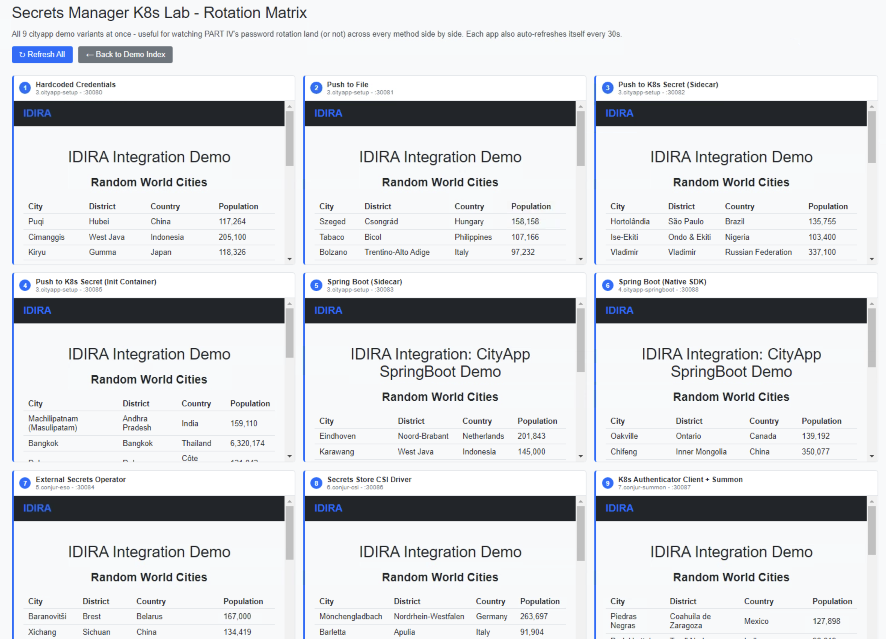

| App | Port | After rotation |
|---|---|---|
| cityapp-conjurtok8sfile | 30081 | ✅ Live - no redeploy needed |
| cityapp-conjurtok8ssecret | 30082 | ✅ Live - no redeploy needed |
| cityapp-conjurtok8ssecret-init | 30085 | 🔁 Needs a redeploy |
| cityapp-springboot-sidecar | 30083 | 🔁 Needs a redeploy |
| cityapp-springboot-native | 30088 | 🔁 Needs a redeploy |
| cityapp-csi | 30086 | 🔁 Needs a redeploy |
| cityapp-summon | 30087 | 🔁 Needs a redeploy |
| cityapp-hardcode | 30080 | ❌ Broken by design - optional manual fix in Step4.5 |
| cityapp-eso | 30084 | ❌ Broken until Step4.3 or Step4.4 |

<details>
<summary>Why does each app behave this way?</summary>

- **Live, no redeploy**: both read the secret from a shared volume (a file or a K8s Secret) that the secrets-provider sidecar keeps refreshing on its own interval - the app just reads whatever's currently there on every page load.
- **Needs a redeploy**: each of these fetches the secret exactly once and has no ongoing refresh process afterward, just for different reasons per method - ```conjurtok8ssecret-init```'s Secrets Provider is a true initContainer that exits after running once; ```springboot-sidecar```'s password is wired up as a `secretKeyRef` **env var**, which Kubernetes captures once at pod start even though the sidecar keeps the underlying Secret current; ```springboot-native``` fetches once via the Secrets Manager SDK at Spring startup; this lab's CSI driver install doesn't have secret rotation enabled, so the mounted volume is fetched once at mount time; and Summon fetches once, then ```exec```s into cityapp's own process, leaving nothing running afterward to refetch anything.
- **Broken by design**: ```cityapp-hardcode``` never talks to Secrets Manager at all, so it can never see a rotated password - see Step4.5 for the only way to fix it (manually). ```cityapp-eso``` reads ```test/CityAppESO/DBAccountESO/*```, a separate copy of the credentials that Step4.1 intentionally does not touch - see Step4.3 to repair it.
</details>

## Step4.2: Redeploy the apps that don't update live
```
./02.redeploying-rotated-apps.sh
```
Redeploys all 5 "needs a redeploy" apps from the table above in one step. Each one lives in a different folder, and each folder's own deploy script only works with that folder as the current directory (```source 00.config.sh```, ```yaml/...``` are relative paths) - so this script ```cd```s into each one internally before calling it. That also means it only works run from inside ```8.rotate-password/``` itself, the same as every other script in this lab - don't try to call it, or the scripts it wraps, from a different folder directly.

## Step4.3 (optional): Repair cityapp-eso
```
./01.rotating-db-password.sh eso
```
No new password, no MySQL change - just copies ```test/CityApp/DBAccount/password```'s current value into ```test/CityAppESO/DBAccountESO/password```. ```cityapp-eso``` picks it up on its own ESO sync schedule.

## Step4.4 (alternative to Step4.1): Rotate both together
```
./01.rotating-db-password.sh all
```
Same MySQL rotation as Step4.1, but updates ```test/CityApp/DBAccount/password``` and ```test/CityAppESO/DBAccountESO/password``` together in one step - only ```cityapp-hardcode``` is left stuck on the old password. Still run Step4.2 afterward for the same 5 apps - ```all``` mode rotates the real password too, it just also keeps ```cityapp-eso``` in sync at the same time.
```
./02.redeploying-rotated-apps.sh
```

## Step4.5 (optional): Manually fix cityapp-hardcode
```
./03.redeploying-cityapp-hardcode.sh
```
```cityapp-hardcode``` has no secret to rotate - its password is a literal string baked into its Deployment spec, not a reference to anything in Secrets Manager. There's no live-update, no refresh-and-redeploy, nothing to repair through Secrets Manager at all - the only way to fix it is to manually edit that string and redeploy, which is exactly what this script does, echoing the before/after so the manual edit is visible instead of hidden:
```
ℹ️  cityapp-hardcode has no secret to rotate - its password is a literal string in the spec. Replacing it by hand:

  --- current spec ---
          - name: DBPASS
            value: 'oldpassword...'

  --- new spec ---
          - name: DBPASS
            value: 'newpassword...'
```
This "fix" only holds until the next rotation - unlike every other variant in this lab, there's no way to make ```cityapp-hardcode``` pick up a password change automatically.
# --- LAB END ---
