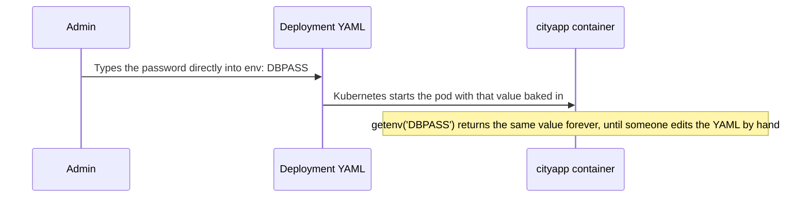
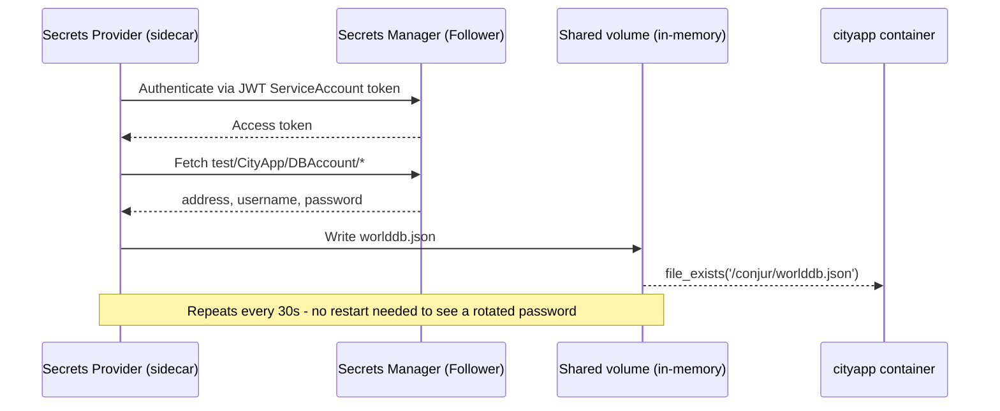
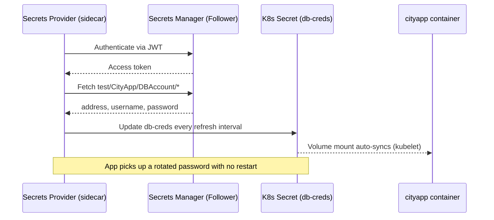
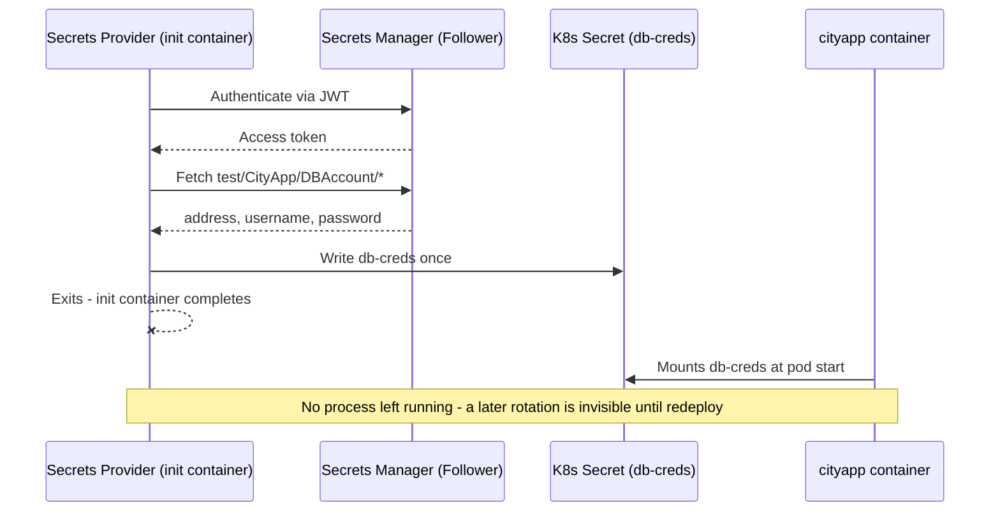
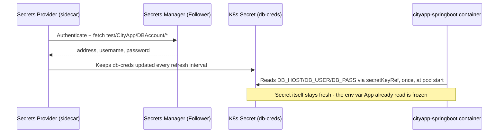
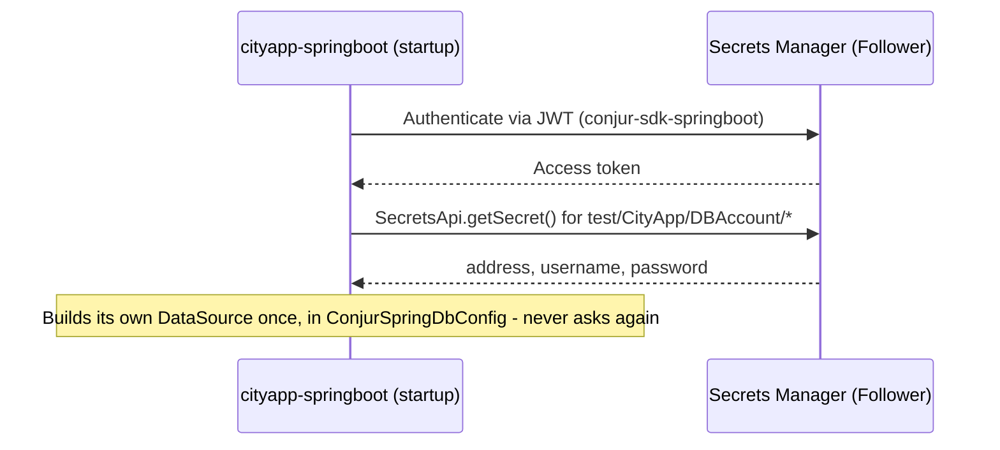
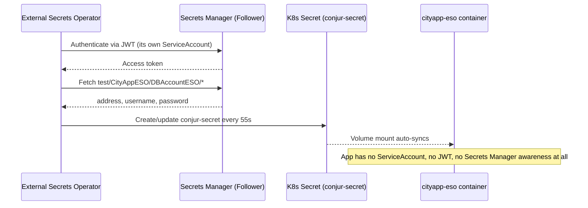
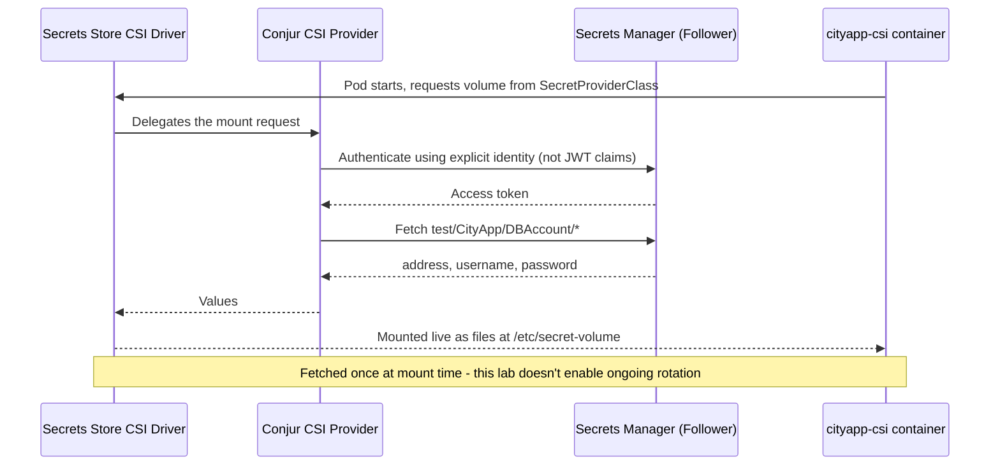
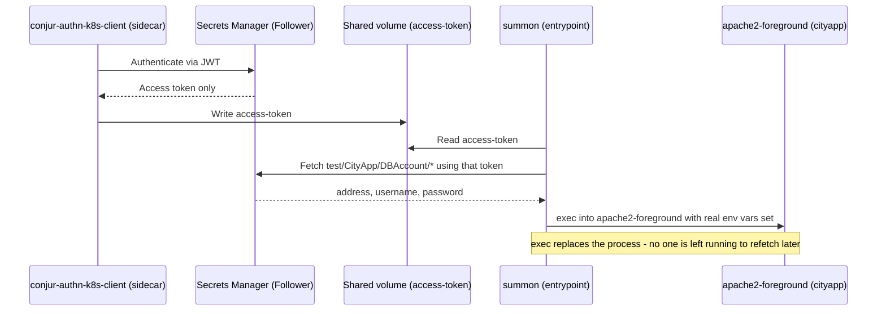

# Explaining the 9 Use Cases

This document explains, in plain English, how each of the 9 `cityapp` variants in this lab actually gets its database password. It's written for readers who've never touched DevOps or Kubernetes before - if you already know what a sidecar or a Kubernetes Secret is, skip straight to the [comparison table](#comparison-table) and the method you're curious about.

Every code snippet below is copied directly from this repo (not simplified or made up), so what you read here matches exactly what's running in the lab.

## How cityapp decides where to look

Before diving into the 9 methods, one thing is shared by most of them: the PHP app (`3.cityapp-setup/build/index.php`) doesn't know or care which method is in play. It just checks, in order, whether a password showed up as a plain environment variable, then a JSON file, then a Kubernetes Secret mounted as files:

```php
$db_addr=getenv('DBADDR');
...
if(!empty($db_addr))
{
  $host=$db_addr;
  ...
}
elseif(file_exists('/conjur/worlddb.json'))
{
  $secrets_source="FILE /conjur/worlddb.json";
  ...
}
elseif(file_exists('/etc/secret-volume'))
{
  $secrets_source="K8S SECRETS";
  $host = file_get_contents('/etc/secret-volume/dbaddr');
  ...
}
```

This is why the same cityapp image can be reused, unmodified, across 6 of the 9 methods below - the interesting differences all happen *before* this code runs, in how something gets a value into an env var, a file, or `/etc/secret-volume` in the first place. That "how" is what each section below actually explains.

## Glossary (read this once, use it for every section below)

| Term | Plain-English meaning |
|---|---|
| **Pod** | The running instance of an app inside Kubernetes - think of it as "the box the app lives in." |
| **Sidecar** | A second, helper container that runs *alongside* the app container, in the same Pod, for as long as the Pod lives. |
| **Init container** | Like a sidecar, but it runs once, to completion, *before* the app container starts - then it's gone for good. |
| **ServiceAccount** | An identity Kubernetes gives to a Pod, so it can prove "I am this specific app" to other systems. |
| **JWT (JSON Web Token)** | A signed, tamper-proof digital ID card. Kubernetes issues one to a Pod's ServiceAccount; Secrets Manager checks that ID card before handing over anything. |
| **Annotation** | A note attached to a Kubernetes object's spec (`conjur.org/...` in this lab) that a controller or sidecar reads to configure its own behavior - it's metadata, not code. |
| **Kubernetes Secret** | Kubernetes' own native object for storing a small piece of sensitive data, separately from the Pod spec itself. |
| **Volume mount** | Making a Secret (or a file) appear as files inside a Pod's filesystem, at a path like `/etc/secret-volume`. |
| **CSI Driver** | A Kubernetes plugin system for volumes; the "Secrets Store CSI Driver" is a specific one built for mounting secrets live from an external vault. |

## Comparison table

| # | Method | Does the app talk to Secrets Manager itself? | Where the app reads the secret | Updates automatically after a rotation? |
|---|---|---|---|---|
| 1 | [Hardcoded env var](#1-hardcoded-environment-variable-cityapp-hardcode) | No - and nothing else does either | Plain `env:` value in the Deployment spec | Never - it's a literal string |
| 2 | [Push-to-File](#2-push-to-file-cityapp-conjurtok8sfile) | No (a sidecar does) | JSON file at `/conjur/worlddb.json` | Yes, live |
| 3 | [Push-to-K8s-Secret (sidecar)](#3-push-to-k8s-secret-sidecar-cityapp-conjurtok8ssecret) | No (a sidecar does) | Files under `/etc/secret-volume` | Yes, live |
| 4 | [Push-to-K8s-Secret (init container)](#4-push-to-k8s-secret-init-container-cityapp-conjurtok8ssecret-init) | No (an init container does, once) | Files under `/etc/secret-volume` | No - needs a redeploy |
| 5 | [Spring Boot + sidecar](#5-spring-boot--secrets-provider-sidecar-cityapp-springboot-sidecar) | No (a sidecar does) | `env:` value via `secretKeyRef`, read once at pod start | No - needs a redeploy |
| 6 | [Spring Boot native SDK](#6-spring-boot-native-sdk-cityapp-springboot-native) | Yes, directly | Built into the app's DB connection at startup | No - needs a redeploy |
| 7 | [External Secrets Operator](#7-external-secrets-operator-eso-cityapp-eso) | No (ESO does, outside the pod entirely) | Files under `/etc/secret-volume` | Yes, live (on ESO's own schedule) |
| 8 | [Secrets Store CSI Driver](#8-secrets-store-csi-driver-cityapp-csi) | No (the CSI driver/provider does) | Files under `/etc/secret-volume` | No in this lab (rotation reconciliation isn't enabled) |
| 9 | [Kubernetes Authenticator Client + Summon](#9-kubernetes-authenticator-client--summon-cityapp-summon) | Partially - a sidecar authenticates, but `summon` itself (baked into the app's image) fetches the value | Injected as real process env vars before the app starts | No - needs a redeploy |

---

## 1. Hardcoded Environment Variable (`cityapp-hardcode`)

**In plain English:** this is like writing your house key's exact shape on a sticky note and taping it to your front door. Anyone who can read the door can copy the key - and if the lock ever changes, the sticky note doesn't update itself.

**How it works:**
1. Someone types the real database password directly into the Kubernetes Deployment file, as plain text.
2. Kubernetes starts the Pod with that value baked in as an environment variable.
3. The app reads it with a normal `getenv('DBPASS')` call - there's no Secrets Manager involved anywhere in this chain.



<details>
<summary>Show the actual code (from this repo)</summary>

```yaml
# 3.cityapp-setup/yaml/cityapp-hardcode.yaml
env:
  - name: DEMO_METHOD
    value: hardcode
  - name: DBADDR
    value: '{DB_HOST}'
  - name: DBUSER
    value: '{DB_USER}'
  - name: DBPASS
    value: '{DB_PASSWORD}'
```
</details>

**Docs:** none apply - this method doesn't use Secrets Manager at all, which is exactly the point.

**When would a real team do this?** Never, deliberately - this exists purely as the "before" picture. It's the anti-pattern every other method in this lab is an improvement on.

**Security note:** anyone with `kubectl get pod -o yaml` permission on this namespace can read the password in plain text. It also ends up in Kubernetes' own audit logs and any backup of the cluster's etcd store.

---

## 2. Push-to-File (`cityapp-conjurtok8sfile`)

**In plain English:** a locksmith (a helper container) slips a fresh key under your welcome mat every 30 seconds. You just check under the mat when you need it - you never talk to the locksmith directly, and neither does anyone else.

**How it works:**
1. A second container ("sidecar") in the same Pod proves its identity to Secrets Manager using a signed JWT token Kubernetes automatically issued it.
2. Secrets Manager checks that identity against policy, then hands back the database address, username, and password.
3. The sidecar writes those values into a JSON file on a memory-only volume shared with the app container.
4. The app just reads that file - it never talks to Secrets Manager itself.
5. The sidecar repeats steps 1-3 every 30 seconds (`conjur.org/secrets-refresh-interval`), so a password rotation shows up automatically.



<details>
<summary>Show the actual code (from this repo)</summary>

```yaml
# 3.cityapp-setup/yaml/cityapp-conjurtok8sfile.yaml
annotations:
  conjur.org/container-mode: sidecar
  conjur.org/secrets-destination: file
  conjur.org/jwt-token-path: /var/run/secrets/tokens/jwt
  conjur.org/conjur-secrets.cityapp-conjurtok8sfile: |
    - dbaddr: test/CityApp/DBAccount/address
    - dbuser: test/CityApp/DBAccount/username
    - dbpass: test/CityApp/DBAccount/password
  conjur.org/secret-file-path.cityapp-conjurtok8sfile: ./worlddb.json
  conjur.org/secret-file-format.cityapp-conjurtok8sfile: 'json'
  conjur.org/secrets-refresh-interval: 30s
```

```php
// 3.cityapp-setup/build/index.php
elseif(file_exists('/conjur/worlddb.json'))
{
  $secrets_source="FILE /conjur/worlddb.json";
  $json_data = file_get_contents('/conjur/worlddb.json');
  $response_data = json_decode($json_data);
  $host = $response_data->dbaddr;
  $user = $response_data->dbuser;
  $pass = $response_data->dbpass;
}
```
</details>

**Docs:** [IDIRA Secrets Provider: Push to File mode](https://docs.cyberark.com/Product-Doc/OnlineHelp/AAM-DAP/Latest/en/Content/Integrations/k8s-ocp/cjr-k8s-secrets-provider-ic-p2f.htm?TocPath=Integrations%7COpenShift%2FKubernetes%7CSet%20up%20applications%7CSecrets%20Provider%20for%20Kubernetes%7CInit%20container%7C_____2 "Push to file")

**When would a real team use this?** Legacy apps that can only read config from a file on disk, and can't be changed to read a Kubernetes Secret or an env var.

**Security note:** the file lives on an in-memory volume (never touches disk), and only the app container in this specific Pod can read it - a real improvement over method #1, but the value is still sitting in plaintext inside the container's filesystem while it runs.

---

## 3. Push-to-K8s-Secret, sidecar (`cityapp-conjurtok8ssecret`)

**In plain English:** same locksmith as above, but instead of hiding a physical key under your mat, they register the current key with the building's front desk (a Kubernetes Secret). Any tenant with permission can ask the front desk for it - and the front desk's copy updates automatically.

**How it works:**
1. Same sidecar authentication and fetch as Push-to-File (steps 1-2 above).
2. Instead of a file, the sidecar writes the values into a native Kubernetes Secret object (`db-creds`) - this requires the sidecar's ServiceAccount to have RBAC permission to update Secrets.
3. Kubernetes mounts that Secret as files at `/etc/secret-volume` in the app container - and because it's a **volume mount**, kubelet keeps it in sync automatically, on its own internal schedule, with no help needed from the sidecar or the app.



<details>
<summary>Show the actual code (from this repo)</summary>

```yaml
# 3.cityapp-setup/yaml/cityapp-conjurtok8ssecret.yaml
stringData:
  conjur-map: |-
    dbaddr: test/CityApp/DBAccount/address
    dbuser: test/CityApp/DBAccount/username
    dbpass: test/CityApp/DBAccount/password
---
annotations:
  conjur.org/container-mode: sidecar
  conjur.org/secrets-refresh-interval: 30s
```

```php
// 3.cityapp-setup/build/index.php
elseif(file_exists('/etc/secret-volume'))
{
  $secrets_source="K8S SECRETS";
  $host = file_get_contents('/etc/secret-volume/dbaddr');
  $user = file_get_contents('/etc/secret-volume/dbuser');
  $pass = file_get_contents('/etc/secret-volume/dbpass');
}
```
</details>

**Docs:** [IDIRA Secrets Provider: Kubernetes Secret mode](https://docs.cyberark.com/Product-Doc/OnlineHelp/AAM-DAP/Latest/en/Content/Integrations/k8s-ocp/cjr-k8s-secrets-provider-ic.htm?tocpath=Integrations%7COpenShift%252FKubernetes%7CApp%20owner%253A%20Set%20up%20workloads%20in%20Kubernetes%7CSet%20up%20workloads%20(cert-based%20authn)%7CSecrets%20Provider%20for%20Kubernetes%7CInit%20container%252FSidecar%7C_____1 "Push to secret")

**When would a real team use this?** Any app that already knows how to read a standard Kubernetes Secret volume mount, without needing custom code for Secrets Manager or JWT.

**Security note:** the RBAC granted to the sidecar's ServiceAccount is scoped to exactly one named Secret (`db-creds`), not "all Secrets in the namespace" - worth checking that scoping any time you copy this pattern elsewhere.

---

## 4. Push-to-K8s-Secret, init container (`cityapp-conjurtok8ssecret-init`)

**In plain English:** the locksmith comes exactly once, before you even move into the apartment, drops a key off at the front desk, and then leaves town for good. If the lock is ever changed later, nobody's coming back to update the front desk unless you call the locksmith again yourself.

**How it works:**
1. Before the app container starts at all, an **init container** (not a sidecar - it runs once and exits) authenticates and fetches the secret, exactly like method #3.
2. It writes the value into the `db-creds` Kubernetes Secret, then exits for good - there's no ongoing process left in this Pod after that.
3. The app container starts afterward and mounts `db-creds` the same way as method #3.
4. If the password rotates later, nothing in this Pod is watching for it - you have to manually redeploy to get a new init container run.



<details>
<summary>Show the actual code (from this repo)</summary>

```yaml
# 3.cityapp-setup/yaml/cityapp-conjurtok8ssecret-init.yaml
initContainers:
- name: conjurtok8ssecretinit
  image: docker.io/cyberark/secrets-provider-for-k8s:1.10.0
  env:
  - name: JWT_TOKEN_PATH
    value: /var/run/secrets/tokens/jwt
  - name: CONTAINER_MODE
    value: init
  - name: K8S_SECRETS
    value: db-creds
  - name: SECRETS_DESTINATION
    value: k8s_secrets
```

No `conjur.org/container-mode` or `conjur.org/secrets-refresh-interval` annotation here at all - neither one applies to a real `initContainers:` entry, since it runs once and there's nothing left afterward to refresh anything on a schedule.
</details>

**Docs:** [IDIRA Secrets Provider: Kubernetes Secret mode](https://docs.cyberark.com/Product-Doc/OnlineHelp/AAM-DAP/Latest/en/Content/Integrations/k8s-ocp/cjr-k8s-secrets-provider-ic.htm?tocpath=Integrations%7COpenShift%252FKubernetes%7CApp%20owner%253A%20Set%20up%20workloads%20in%20Kubernetes%7CSet%20up%20workloads%20(cert-based%20authn)%7CSecrets%20Provider%20for%20Kubernetes%7CInit%20container%252FSidecar%7C_____1 "Push to secret") (same tool, different placement - see the "Init container" tab)

**When would a real team use this?** Environments that want one less long-running sidecar process per Pod, and are comfortable redeploying (or otherwise restarting Pods) as part of their rotation procedure.

**Security note:** functionally equivalent to method #3 while running - the tradeoff is entirely about rotation behavior, not who can see the secret.

---

## 5. Spring Boot + Secrets Provider sidecar (`cityapp-springboot-sidecar`)

**In plain English:** same locksmith-to-front-desk pattern as method #3, but you (the app) memorize the key the moment you move in and never check the front desk again. The front desk's copy stays current - you just stop looking at it.

**How it works:**
1. Identical sidecar mechanism as method #3 - it authenticates, fetches, and keeps the `db-creds` Secret current on a schedule.
2. The difference is entirely on the app side: this Spring Boot app reads its DB host/user/password as Kubernetes `secretKeyRef` **environment variables**, not a file.
3. Kubernetes only reads a Secret into an env var **once, at Pod start** - unlike a volume mount, an env var never live-updates, even while the sidecar keeps the underlying Secret object fresh.



<details>
<summary>Show the actual code (from this repo)</summary>

```yaml
# 4.cityapp-springboot/yaml/cityapp-springboot-sidecar.yaml
annotations:
  conjur.org/container-mode: sidecar
  conjur.org/secrets-refresh-interval: 30s
...
env:
- name: DB_HOST
  valueFrom:
    secretKeyRef:
      name: db-creds
      key: dbaddr
```
</details>

**Docs:** [IDIRA Secrets Provider: Kubernetes Secret mode](https://docs.cyberark.com/Product-Doc/OnlineHelp/AAM-DAP/Latest/en/Content/Integrations/k8s-ocp/cjr-k8s-secrets-provider-ic.htm?tocpath=Integrations%7COpenShift%252FKubernetes%7CApp%20owner%253A%20Set%20up%20workloads%20in%20Kubernetes%7CSet%20up%20workloads%20(cert-based%20authn)%7CSecrets%20Provider%20for%20Kubernetes%7CInit%20container%252FSidecar%7C_____1 "Push to secret")

**When would a real team use this?** Any framework or app that only knows how to read config from environment variables at startup (very common), and where a redeploy is an acceptable part of your rotation runbook.

**Security note:** the exact same mechanism as method #3 "under the hood," but this side-by-side comparison is exactly why this lab includes both - identical infrastructure, opposite rotation behavior, purely because of how the app *consumes* the value.

---

## 6. Spring Boot native SDK (`cityapp-springboot-native`)

**In plain English:** you skip the front desk entirely and call the locksmith's official phone line yourself, once, when you first move in, and ask for the current key. You memorize it and never call again.

**How it works:**
1. There's no sidecar or init container in this Pod at all - the app itself, at Spring Boot startup, uses IDIRA's `conjur-sdk-springboot` library to authenticate directly to Secrets Manager via JWT.
2. It calls `SecretsApi.getSecret()` for each of the three variable paths, gets back the real values, and builds its own database connection string with them.
3. This all happens once, inside a single Spring `@Configuration` class, when the application context starts up - there's no refresh loop anywhere in this code.



<details>
<summary>Show the actual code (from this repo)</summary>

```java
// 4.cityapp-springboot/build/src/.../ConjurSpringDbConfig.java
@Value ("${CONJUR_MAPPING_DB_HOST}")
private String dbhost_var;
...
private final SecretsApi secretsApi = new SecretsApi();

@Override
public void afterPropertiesSet() throws Exception {
    super.afterPropertiesSet();
    if (!dbhost_var.isBlank() && !dbuser_var.isBlank() && !dbpass_var.isBlank()) {
        String dbhost = secretsApi.getSecret("DEMO", ConjurConstant.CONJUR_KIND, new String(dbhost_var));
        String dbuser = secretsApi.getSecret("DEMO", ConjurConstant.CONJUR_KIND, new String(dbuser_var));
        String dbpass = secretsApi.getSecret("DEMO", ConjurConstant.CONJUR_KIND, new String(dbpass_var));
        ...
        this.setUrl(dburl);
        this.setUsername(new String(dbuser));
        this.setPassword(new String(dbpass));
    }
}
```
```yaml
# 4.cityapp-springboot/yaml/cityapp-springboot-native.yaml
- name: CONJUR_MAPPING_DB_HOST
  value: test/CityApp/DBAccount/address
- name: CONJUR_MAPPING_DB_USER
  value: test/CityApp/DBAccount/username
- name: CONJUR_MAPPING_DB_PASS
  value: test/CityApp/DBAccount/password
```
</details>

**Docs:** IDIRA's documentation portal ([docs.cyberark.com](https://docs.cyberark.com/)) - search for `conjur-sdk-springboot`. This repo hasn't found a deep link into that portal stable enough to commit to (see CLAUDE.md's note on doc-link rot), so only the root is linked here.

**When would a real team use this?** Teams already standardized on Spring Boot who'd rather have one less moving part (no sidecar container at all) and are comfortable writing a small amount of app-specific integration code.

**Security note:** the app process itself now holds a Secrets Manager identity and calls its API directly - a larger blast radius if that specific app is compromised, compared to methods where only a separate sidecar process ever talks to Secrets Manager.

---

## 7. External Secrets Operator (ESO) (`cityapp-eso`)

**In plain English:** a property management service checks with the locksmith on your behalf, on a schedule, and keeps the front desk's key record current automatically. You never even know the locksmith exists - you just trust the front desk.

**How it works:**
1. A cluster-wide controller (ESO), running completely outside this app's Pod, authenticates to Secrets Manager using its own JWT ServiceAccount identity.
2. It fetches the values from a *separate* variable set (`test/CityAppESO/DBAccountESO/*` - distinct from every other method above) and writes them into a native Kubernetes Secret (`conjur-secret`).
3. It does this again every 55 seconds (`refreshInterval`), regardless of whether `cityapp-eso` is even running.
4. `cityapp-eso` just mounts `conjur-secret` as a volume - the exact same cityapp image used in methods #1-4, completely unmodified, with **zero** Secrets Manager awareness: no ServiceAccount, no JWT, no sidecar.



<details>
<summary>Show the actual code (from this repo)</summary>

```yaml
# 5.conjur-eso/yaml/conjur-external-secret.yaml
spec:
  refreshInterval: 55s
  secretStoreRef:
    name: conjur
    kind: SecretStore
  target:
    name: conjur-secret
  data:
  - secretKey: dbaddr
    remoteRef:
      key: test/CityAppESO/DBAccountESO/address
  - secretKey: dbuser
    remoteRef:
      key: test/CityAppESO/DBAccountESO/username
  - secretKey: dbpass
    remoteRef:
      key: test/CityAppESO/DBAccountESO/password
```
```yaml
# 5.conjur-eso/yaml/cityapp-eso.yaml
# No Conjur awareness needed here at all - ESO already resolved the
# secret into a plain k8s Secret, so cityapp just mounts it like any
# other Kubernetes-native app would.
volumeMounts:
  - name: secret-volume
    mountPath: /etc/secret-volume
    readOnly: true
```
</details>

**Docs:** [External Secrets Operator](https://external-secrets.io/latest/)

**When would a real team use this?** Teams standardizing secret consumption the same way across multiple secret backends (not just Secrets Manager) - ESO supports many providers behind one consistent `ExternalSecret` API, so app teams only ever need to know "read a Kubernetes Secret."

**Security note:** the app trusts whatever's in `conjur-secret` completely - if ESO's own sync ever gets misconfigured (see the real incident this lab hit, where the `ExternalSecret` kept a stale key path after a rename), the app has no way to tell the difference between "correct" and "stale," since it has no visibility into Secrets Manager at all.

---

## 8. Secrets Store CSI Driver (`cityapp-csi`)

**In plain English:** instead of registering a key with the front desk, the building itself has a smart wall-safe right outside your door that a maintenance robot restocks directly - authenticating using your unit number, not a personal ID card.

**How it works:**
1. The Pod's spec declares a special CSI volume, pointing at a `SecretProviderClass` object instead of a Kubernetes Secret.
2. At mount time, the Secrets Store CSI Driver hands the request to IDIRA's own CSI provider, which authenticates to Secrets Manager using an **explicit identity** (`host/jwt-apps/k8s-csi/k8s-csi-host`) rather than resolving one from a JWT token's claims - so this Pod needs no ServiceAccount token projection at all.
3. The provider fetches the values and the driver mounts them live as files at `/etc/secret-volume`, at Pod startup.
4. This lab's CSI driver install doesn't enable rotation reconciliation, so this only happens once, when the Pod starts - a later rotation needs a redeploy to pick up.



<details>
<summary>Show the actual code (from this repo)</summary>

```yaml
# 6.conjur-csi/yaml/05.conjur-csi-provider-class-config.yaml
kind: SecretProviderClass
spec:
  provider: conjur
  parameters:
    conjur.org/configurationVersion: 0.2.0
    authnId: authn-jwt/k8s-csi
    identity: host/jwt-apps/k8s-csi/k8s-csi-host
```
```yaml
# 6.conjur-csi/yaml/06.cityapp-csi.yaml
annotations:
  conjur.org/secrets: |
    - "dbaddr": "test/CityApp/DBAccount/address"
    - "dbuser": "test/CityApp/DBAccount/username"
    - "dbpass": "test/CityApp/DBAccount/password"
...
volumes:
- name: conjur-csi-volume
  csi:
    driver: secrets-store.csi.k8s.io
    volumeAttributes:
      secretProviderClass: "conjur-credentials"
```
</details>

**Docs:** [Kubernetes Secrets Store CSI Driver](https://kubernetes-csi.github.io/docs/)

**When would a real team use this?** Environments already standardized on the CSI Driver for other secret backends (AWS/Azure/GCP/HashiCorp providers all plug into the same interface), where "one consistent volume-mount pattern regardless of backend" matters more than per-app JWT identity.

**Security note:** the pod-level RBAC surface is smaller than JWT-based methods (no ServiceAccount token to project or steal), but it shifts trust onto the driver and provider processes running with cluster-wide privilege - worth understanding who can create or edit `SecretProviderClass` objects in your cluster.

---

## 9. Kubernetes Authenticator Client + Summon (`cityapp-summon`)

**In plain English:** a guard checks your ID (a JWT) and hands you a temporary building pass - nothing more. You then use that pass yourself, walk to the locksmith's counter, and get the actual key. Nobody hands you the key directly, and nobody automates fetching it for you either - but once you're inside, you're inside for good, until someone lets you back out and in again.

**How it works:**
1. A sidecar (`conjur-authn-k8s-client`) authenticates the Pod via JWT - but unlike every other method above, it fetches **only an access token**, never the secret itself, and writes that token to a shared volume.
2. The main container's entrypoint isn't `apache2-foreground` directly - it's `summon`, a small tool baked into this variant's own image, wrapping the real command.
3. `summon` reads that access token, uses it to call the Secrets Manager REST API itself, and fetches the real database values.
4. `summon` then `exec`s into `apache2-foreground` with those values injected as real process environment variables - cityapp's own code never changes, it just sees `getenv('DBADDR')` populated, the same as method #1.
5. Because `summon` used `exec` (not fork-and-monitor), there's no `summon` process left running afterward to refetch anything later - a rotation needs a redeploy.



<details>
<summary>Show the actual code (from this repo)</summary>

```dockerfile
# 7.conjur-summon/build/Dockerfile
ENTRYPOINT ["/usr/local/bin/summon", "-f", "/etc/summon/secrets.yml", "/usr/local/bin/apache2-foreground"]
```
```yaml
# 7.conjur-summon/yaml/cityapp-summon.yaml (ConfigMap mounted at /etc/summon/secrets.yml)
data:
  secrets.yml: |-
    DBADDR: !var test/CityApp/DBAccount/address
    DBUSER: !var test/CityApp/DBAccount/username
    DBPASS: !var test/CityApp/DBAccount/password
```
```yaml
# same file - the two containers in this pod
containers:
- name: cityapp
  env:
    - name: CONJUR_AUTHN_TOKEN_FILE
      value: /run/conjur/access-token
- name: authenticator
  image: docker.io/cyberark/conjur-authn-k8s-client:0.26.13
```
</details>

**Docs:** [Summon](https://github.com/cyberark/summon) (the entrypoint tool); `conjur-authn-k8s-client` is the sidecar image name (`docker.io/cyberark/conjur-authn-k8s-client`), no separate doc link needed beyond IDIRA's portal.

**When would a real team use this?** Legacy or third-party apps you can't add a Secrets Manager SDK to, but which already read plain process environment variables - `summon` wraps the process without touching its code at all.

**Security note:** this is the only method in the lab where authentication and secret retrieval are handled by two entirely separate identities/steps (the sidecar only ever proves identity; `summon` only ever spends the resulting token) - a deliberate separation of concerns that limits what the sidecar itself can access.
